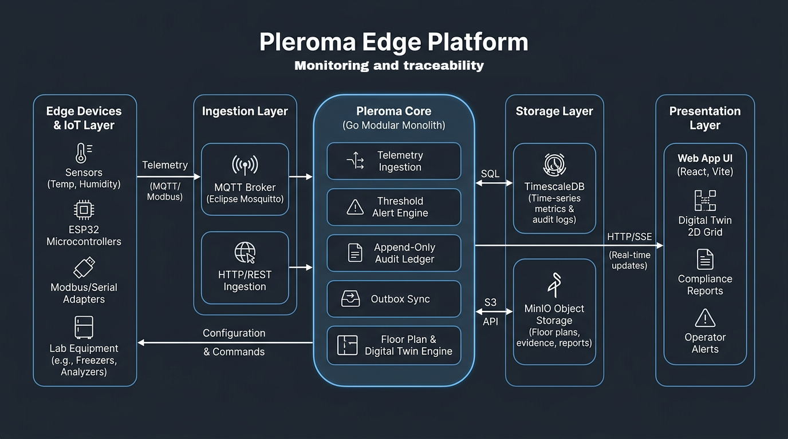
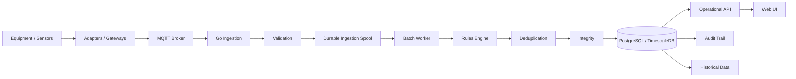
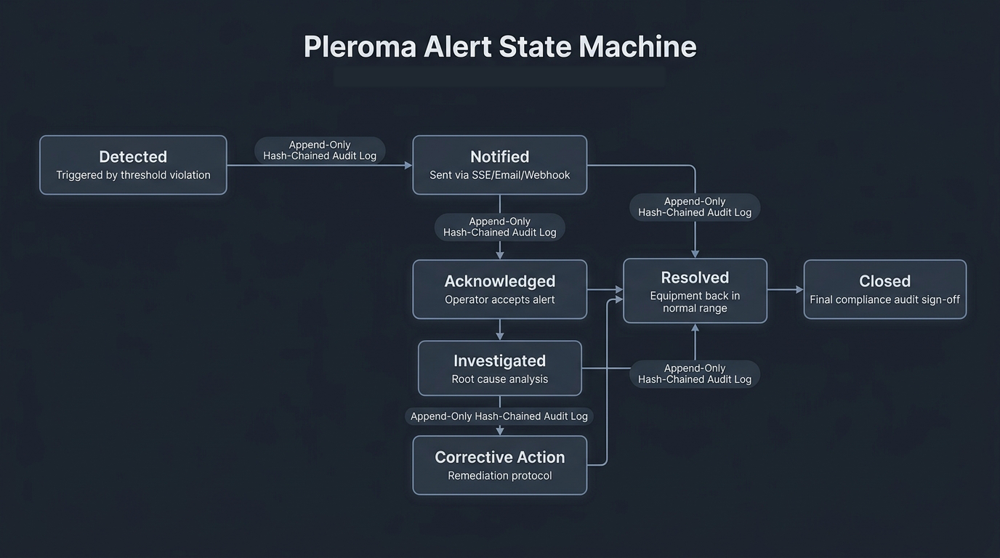
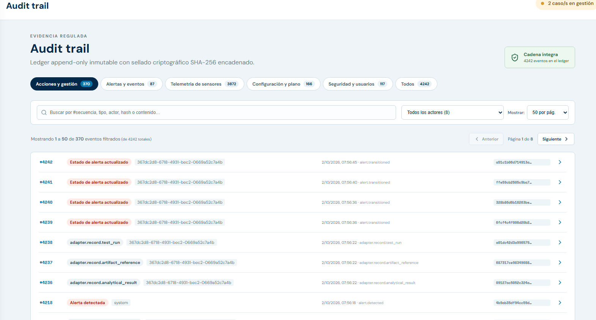
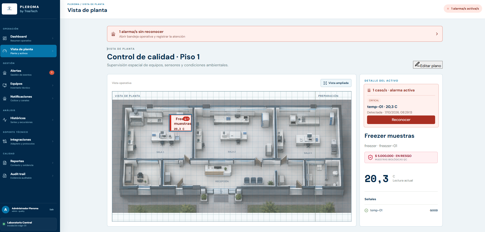
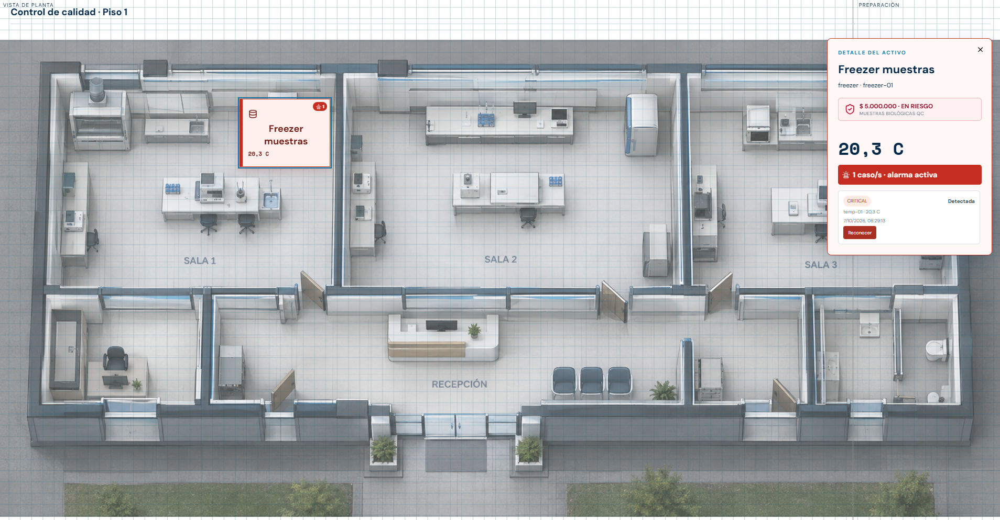
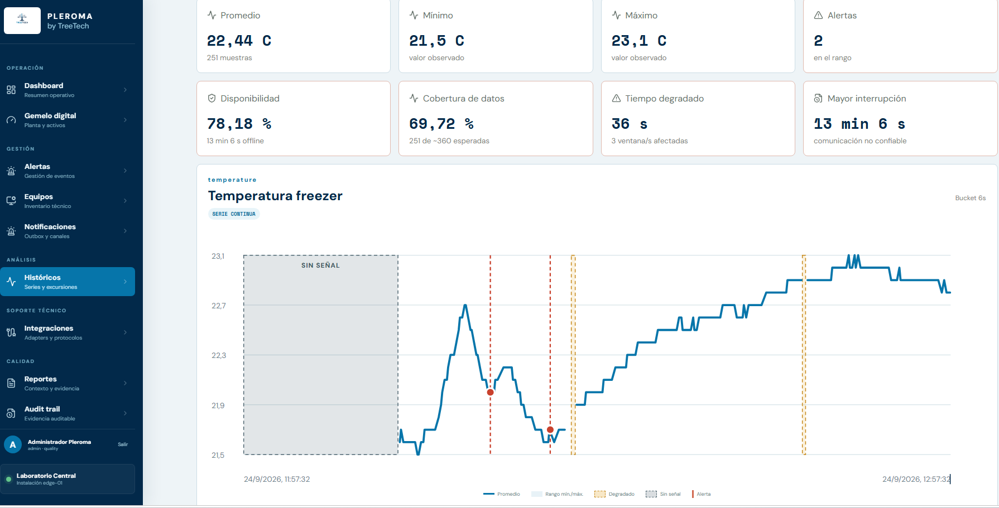
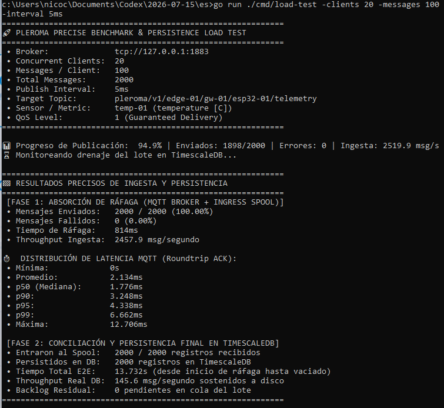

# Pleroma

### Plataforma de monitoreo, integración y trazabilidad operativa para entornos industriales

**Pleroma** es una plataforma desarrollada por **Treetech** para integrar información proveniente de equipos, sensores y sistemas heterogéneos y convertirla en una capa operacional común.

El objetivo no es reemplazar necesariamente la infraestructura existente, sino construir el software que falta entre los equipos, los datos y las personas que necesitan utilizarlos.

Pleroma centraliza:

- Telemetría y variables operativas
- Estado y salud técnica de equipos y dispositivos
- Alertas y eventos
- Históricos y tendencias
- Trazabilidad de acciones
- Integridad de registros
- Backlog y estado de la ingesta
- Información operacional para operadores y responsables técnicos

El proyecto está siendo desarrollado como un **motor reutilizable**, capaz de adaptarse a distintas fuentes de adquisición sin acoplar el núcleo de la plataforma a un protocolo o fabricante específico.

> **El código fuente no forma parte de este repositorio.** Pleroma es tecnología propietaria de Treetech. Este documento describe su arquitectura, decisiones de ingeniería, comportamiento y resultados de pruebas.

---

## Índice

- [El problema](#el-problema)
- [Qué es Pleroma](#qué-es-pleroma)
- [Arquitectura](#arquitectura)
- [Pipeline completo](#pipeline-completo)
- [Adquisición e integración](#adquisición-e-integración)
- [Ingesta durable y backpressure](#ingesta-durable-y-backpressure)
- [Procesamiento de telemetría](#procesamiento-de-telemetría)
- [Idempotencia y deduplicación](#idempotencia-y-deduplicación)
- [Ingeniería de alertas](#ingeniería-de-alertas)
- [Integridad y audit trail](#integridad-y-audit-trail)
- [Estado y salud de los dispositivos](#estado-y-salud-de-los-dispositivos)
- [Vista operacional](#vista-operacional)
- [Gemelo digital](#gemelo-digital)
- [Históricos](#históricos)
- [Diseño del sistema](#diseño-del-sistema)
- [Resiliencia y manejo de fallos](#resiliencia-y-manejo-de-fallos)
- [Pruebas de rendimiento](#pruebas-de-rendimiento)
- [Qué aprendimos de las pruebas](#qué-aprendimos-de-las-pruebas)
- [Decisiones de ingeniería](#decisiones-de-ingeniería)
- [Estado actual](#estado-actual)
- [Próximos pasos](#próximos-pasos)
- [Sobre Treetech](#sobre-treetech)

---

# El problema

En muchas operaciones industriales y técnicas, los equipos ya generan información útil.

El problema suele aparecer después.

Una operación puede tener:

- sensores;
- PLCs;
- instrumentos;
- software de fabricantes;
- gateways;
- archivos;
- planillas;
- sistemas de laboratorio;
- bases de datos;
- registros manuales.

Cada componente puede funcionar correctamente de manera aislada y, aun así, la información quedar fragmentada.

Esto genera preguntas aparentemente simples que pueden ser difíciles de responder:

> ¿Qué ocurrió con este equipo durante las últimas horas?

> ¿Cuándo dejó de transmitir?

> ¿Qué variable estaba fuera de rango?

> ¿Qué alarma se generó?

> ¿Quién la reconoció?

> ¿Qué acción tomó el operador?

> ¿Qué información estaba disponible en ese momento?

> ¿Podemos reconstruir lo ocurrido varios meses después?

Pleroma parte de ese problema.

---

# Qué es Pleroma

Pleroma funciona como una **capa operacional de software** entre las fuentes de datos existentes y las personas o sistemas que necesitan utilizar esa información.

```text
┌─────────────────────────────────────────────────────────────┐
│                    EQUIPOS Y SISTEMAS                      │
│                                                             │
│  Sensores   PLCs   Instrumentos   APIs   Software vendor   │
└──────────────────────────┬──────────────────────────────────┘
                           │
                           ▼
┌─────────────────────────────────────────────────────────────┐
│                     ADQUISICIÓN                             │
│                                                             │
│ MQTT · Modbus · Serial · APIs · Gateways · Drivers         │
└──────────────────────────┬──────────────────────────────────┘
                           │
                           ▼
┌─────────────────────────────────────────────────────────────┐
│                    PLEROMA CORE                             │
│                                                             │
│ Validación · Normalización · Ingesta · Reglas · Eventos    │
│ Deduplicación · Integridad · Persistencia · Audit Trail    │
└──────────────────────────┬──────────────────────────────────┘
                           │
                           ▼
┌─────────────────────────────────────────────────────────────┐
│                  CAPA OPERACIONAL                           │
│                                                             │
│ Dashboard · Alertas · Históricos · Gemelo digital          │
│ Reportes · Trazabilidad · Integraciones                    │
└─────────────────────────────────────────────────────────────┘
```

La característica importante es que el núcleo de Pleroma no necesita conocer el dispositivo físico que originó un dato.

Un adaptador traduce el mundo externo a un **contrato de datos común**.

---

# Arquitectura




A nivel lógico, la arquitectura actual separa dos problemas diferentes:

1. **Recibir información rápidamente y de forma controlada.**
2. **Procesarla y persistirla de manera consistente.**

Esta separación permite absorber ráfagas de telemetría sin obligar a que cada componente posterior procese exactamente a la misma velocidad.



---

# Pipeline completo

Una medición atraviesa conceptualmente el siguiente pipeline:

```text
Physical source
      │
      ▼
Acquisition / Adapter
      │
      ▼
Transport
      │
      ▼
MQTT Broker
      │
      ▼
Pleroma Ingestion
      │
      ├── Identity validation
      ├── Schema validation
      ├── Timestamp validation
      ├── Sequence validation
      │
      ▼
Durable Ingestion Spool
      │
      ▼
Batch Worker
      │
      ├── Deduplication
      ├── Rule evaluation
      ├── Event generation
      ├── Alert state transitions
      ├── Integrity metadata
      │
      ▼
PostgreSQL / TimescaleDB
      │
      ├── Telemetry
      ├── Events
      ├── Alerts
      ├── Actions
      └── Audit Trail
      │
      ▼
Operational API
      │
      ▼
Frontend
```

La separación entre recepción y procesamiento es una de las decisiones arquitectónicas centrales de Pleroma.

---

# Adquisición e integración

Pleroma no presupone una única forma de obtener información.

El mundo externo puede utilizar diferentes protocolos y mecanismos de comunicación.

La arquitectura contempla adaptadores para fuentes como:

- MQTT
- Modbus
- RS-232 / RS-485
- Ethernet
- APIs
- Gateways
- Protocolos propietarios

```text
┌──────────────┐
│    MQTT      │──┐
└──────────────┘  │
                  │
┌──────────────┐  │
│   Modbus     │──┤
└──────────────┘  │
                  ├──► Canonical Data Contract ──► Pleroma Core
┌──────────────┐  │
│ Serial / API │──┤
└──────────────┘  │
                  │
┌──────────────┐  │
│   Gateway    │──┘
└──────────────┘
```

Esto permite que el núcleo de la plataforma trabaje con una representación común sin incorporar lógica específica de cada fabricante.

### Principio de diseño

> **Los adaptadores conocen el mundo externo. El core conoce el modelo operacional.**

Esto reduce el acoplamiento entre adquisición y procesamiento.

---

# Ingesta durable y backpressure

Una de las partes más importantes de la arquitectura es la **cola de ingesta persistente**.

Un sistema de telemetría puede recibir información más rápido de lo que la base de datos o el motor de reglas puede procesarla.

Sin una estrategia de backpressure, el sistema puede terminar acumulando trabajo únicamente en memoria o trasladando la saturación hacia componentes que no fueron diseñados para absorberla.

Pleroma utiliza una cola de ingesta durable para desacoplar ambos ritmos.

```text
                 RECEPCIÓN
                     │
                     ▼
             ┌──────────────┐
             │ MQTT / Go    │
             │  Ingestion   │
             └──────┬───────┘
                    │
                    ▼
          ┌────────────────────┐
          │ Durable Ingestion  │
          │      Spool         │
          └─────────┬──────────┘
                    │
             ┌──────▼──────┐
             │ Batch Worker│
             └──────┬──────┘
                    │
                    ▼
              PROCESAMIENTO
```

La cola permite observar explícitamente:

- cantidad de eventos pendientes;
- velocidad de ingreso;
- velocidad de procesamiento;
- tiempo de permanencia;
- capacidad de drenaje;
- crecimiento del backlog.

### ¿Por qué persistente?

Porque una cola puramente en memoria desaparece ante un reinicio del proceso.

La persistencia permite conservar el trabajo pendiente y procesarlo posteriormente.

### ¿Qué ocurre cuando el consumidor es más lento?

El backlog crece.

Eso no significa necesariamente que el sistema esté fallando.

Puede significar que está **absorbiendo temporalmente una ráfaga** y que posteriormente deberá recuperar el atraso.

Esta distinción es fundamental:

> **Burst capacity y sustainable processing capacity no son la misma métrica.**

---

# Ingeniería de backpressure

Pleroma separa conceptualmente:

```text
Throughput de recepción
        ≠
Throughput de procesamiento
        ≠
Throughput de persistencia
```

Esto permite medir dónde aparece realmente un cuello de botella.

Durante las pruebas se observan variables como:

- ingestion rate;
- processing rate;
- persistence rate;
- queue depth;
- queue wait time;
- database write latency;
- batch size;
- processing latency;
- broker behavior.

El objetivo no es esconder la saturación.

Es hacerla **observable y controlable**.

---

# Idempotencia y deduplicación

En sistemas distribuidos, una operación puede ser reintentada.

Por ejemplo:

```text
Device
  │
  │ sequence = 104
  ▼
Backend
  │
  │ ACK perdido
  ▼
Device
  │
  │ retry sequence = 104
  ▼
Backend
```

El backend recibe dos paquetes, pero ambos representan la misma medición lógica.

Pleroma utiliza identificadores de origen y secuencia junto con restricciones de unicidad para detectar estos casos.

Conceptualmente:

```text
source_key + sequence
        │
        ▼
   unique constraint
        │
   ┌────┴────┐
   │         │
 nuevo     existente
   │         │
 INSERT    IGNORE
```

Esto evita que un reintento genere dos registros lógicos.

La idempotencia no depende únicamente del protocolo de transporte: forma parte de la lógica de persistencia de la aplicación.

---

# Ingeniería de alertas

Una alerta no es simplemente:

```text
temperature > 8
```

En una operación real, una regla necesita contexto.

Pleroma contempla condiciones como:

- umbrales;
- persistencia temporal;
- histéresis;
- pérdida de comunicación;
- recuperación de comunicación;
- duplicados;
- condiciones de operación;
- ventanas temporales;
- escalamiento y notificación.

## Ejemplo: persistencia

Una medición fuera de rango durante un instante puede no representar un evento operacional.

Por eso una regla puede requerir:

```text
Temperature > 8 °C
for at least 60 seconds
```

## Ejemplo: histéresis

Para evitar oscilaciones alrededor de un umbral:

```text
Alarm ON  →  > 8 °C
Alarm OFF →  < 7 °C
```

Esto evita:

```text
ON
OFF
ON
OFF
ON
OFF
```

cuando la señal se encuentra alrededor del límite.

---

## Máquina de estados de una alerta




Conceptualmente:

```text
                 condition met
Normal ─────────────────────────► Active
  ▲                                  │
  │                                  │ operator action
  │                                  ▼
  └──────── condition cleared ─ Resolved
                                     │
                                     │ acknowledgement
                                     ▼
                                Acknowledged
```

El objetivo es separar:

**medición → condición → evento → alerta → acción**

en lugar de tratar todo como el mismo concepto.

---

# Estado y salud de los dispositivos

Pleroma diferencia entre:

> **tener un último valor conocido**

y

> **saber que ese valor sigue siendo representativo del estado actual.**

Por ejemplo:

```text
10:00  → temperature = 4.1 °C
10:01  → temperature = 4.0 °C
10:02  → temperature = 4.1 °C
10:03  → connection lost
10:10  → no new data
```

Mostrar `4.1 °C` como si fuera una medición actual puede resultar engañoso.

Por eso Pleroma mantiene separado:

- último valor conocido;
- último momento de comunicación;
- estado de conexión;
- estado técnico del dispositivo;
- calidad de la información.

Conceptualmente:

```text
ONLINE
   │
   │ missed communication window
   ▼
DEGRADED
   │
   │ timeout
   ▼
OFFLINE
```

El histórico conserva el dato.

El estado operacional indica si todavía podemos confiar en él como información actual.

---

# Integridad y Audit Trail

La trazabilidad requiere algo más que almacenar valores.

Un sistema operacional necesita poder reconstruir:

```text
¿Qué ocurrió?
     │
     ▼
¿Qué equipo estaba involucrado?
     │
     ▼
¿Qué condición se detectó?
     │
     ▼
¿Qué alerta se generó?
     │
     ▼
¿Quién la reconoció?
     │
     ▼
¿Qué acción se realizó?
     │
     ▼
¿Qué ocurrió después?
```

Pleroma conserva eventos y acciones asociados al contexto operacional.

Los registros incorporan mecanismos de **verificación de integridad criptográfica** para poder detectar modificaciones posteriores en los datos protegidos.




### Importante

La utilización de hashes no significa que el sistema sea automáticamente inmutable ni que constituya por sí sola una certificación regulatoria.

El objetivo es proporcionar un mecanismo verificable de integridad dentro de la arquitectura de trazabilidad.

---

# Vista operacional

La interfaz de Pleroma no está pensada únicamente como un dashboard de métricas.

La información se organiza alrededor de los objetos que una persona necesita entender durante la operación.

```text
Operación
├── Activos
├── Equipos
├── Gateways
├── Sensores
├── Variables
├── Eventos
├── Alertas
├── Acciones
└── Históricos
```




La interfaz permite visualizar:

- estado de equipos;
- variables actuales;
- estado de comunicación;
- alarmas;
- eventos recientes;
- ubicación operacional;
- información histórica;
- acciones realizadas.

La intención es que el operador pueda responder:

> **“¿Qué está pasando ahora y qué ocurrió antes?”**

sin tener que reconstruir esa información manualmente desde múltiples sistemas.

---

# Vista de planta

Pleroma incorpora una representación operacional del espacio físico.

Los activos pueden asociarse visualmente a una representación de la instalación.



La interfaz permite:

- crear áreas;
- posicionar componentes;
- mover elementos;
- redimensionar elementos;
- asociar componentes con equipos;
- relacionar equipos con gateways y sensores;
- representar visualmente estados y alarmas.

El objetivo no es construir un sistema CAD.

El objetivo es conservar **contexto espacial y operacional**.

Por ejemplo:

```text
PLANTA
 ├── Área A
 │    ├── Cámara 01
 │    │    ├── Sensor T-01
 │    │    └── Sensor H-01
 │    │
 │    └── Gateway G-01
 │
 └── Área B
      └── Equipo E-02
```

La posición visual se convierte así en una representación de relaciones que también existen en el modelo operacional.

---

# Asociar componentes

El modelo permite separar:

```text
Asset
  │
  ├── Gateway
  │      │
  │      └── Sensor
  │             │
  │             └── Signal
  │
  └── Operational context
```

Esto permite que la interfaz represente relaciones físicas sin que la lógica de negocio dependa de una pantalla específica.

Por ejemplo:

```text
Sensor ESP32
     │
     ▼
Gateway
     │
     ▼
Equipment
     │
     ▼
Area
     │
     ▼
Operational view
```

El drag & drop es la interacción visual.

La asociación persistente es parte del modelo del sistema.

---

# Históricos

Los históricos no muestran únicamente una serie de números.

También representan el contexto en el que esos números fueron obtenidos.



Un gráfico puede representar:

```text
          signal available
                │
Temperature ────┼───────╮
                │       │
                │       ╰─────── no signal
                │
                └──────────────────────── time
```

Cuando un dispositivo deja de transmitir, Pleroma evita presentar automáticamente el último valor conocido como si continuara siendo una medición actual.

Esto permite distinguir:

- valor medido;
- ausencia de señal;
- conexión degradada;
- recuperación;
- eventos y alarmas relacionados.

---

# Diseño del sistema

Una de las decisiones principales de Pleroma es separar responsabilidades.

```text
┌─────────────────────────────┐
│        Acquisition          │
│ MQTT / Modbus / Serial/API  │
└──────────────┬──────────────┘
               │
               ▼
┌─────────────────────────────┐
│          Ingestion          │
│ Identity / Schema / Time    │
└──────────────┬──────────────┘
               │
               ▼
┌─────────────────────────────┐
│      Durable Spool          │
│ Persistent Backpressure     │
└──────────────┬──────────────┘
               │
               ▼
┌─────────────────────────────┐
│       Processing            │
│ Rules / Events / Dedup      │
└──────────────┬──────────────┘
               │
               ▼
┌─────────────────────────────┐
│        Persistence          │
│ PostgreSQL / TimescaleDB    │
└──────────────┬──────────────┘
               │
               ▼
┌─────────────────────────────┐
│       Operational API       │
└──────────────┬──────────────┘
               │
               ▼
┌─────────────────────────────┐
│             UI              │
└─────────────────────────────┘
```

La separación permite evolucionar cada etapa independientemente.

Por ejemplo, incorporar un nuevo protocolo de adquisición no debería requerir modificar el motor de reglas.

---

# Resiliencia y manejo de fallos

Pleroma se prueba considerando que los componentes pueden fallar.

Algunos escenarios considerados:

### Broker o transporte saturado

El sistema debe distinguir entre:

```text
mensaje que nunca llegó
```

y

```text
mensaje que llegó al backend pero todavía no fue procesado
```

Esta distinción es importante para no atribuir pérdidas de transporte a la aplicación.

### Base de datos lenta

La persistencia más lenta puede producir backlog.

El sistema puede continuar acumulando trabajo en la cola durable y procesarlo posteriormente.

### Reinicio del backend

La existencia de una cola persistente permite recuperar trabajo pendiente en lugar de depender exclusivamente de memoria.

### Mensaje duplicado

El mismo evento puede ser recibido nuevamente sin producir necesariamente un segundo registro lógico.

### Mensajes fuera de orden

El sistema valida la información recibida y separa el orden de llegada del significado temporal del evento.

### Procesamiento más lento que la ingesta

El backlog se convierte en una métrica observable:

```text
incoming rate > processing rate

           ↓

       backlog ↑

           ↓

processing rate > incoming rate

           ↓

       backlog ↓
```

---

# Pruebas de rendimiento

El rendimiento de Pleroma no se presenta como un único número.

Se separan diferentes capacidades.

### 1. Burst ingestion

¿Cuántos mensajes puede recibir el pipeline bajo una ráfaga controlada?

### 2. Sustainable processing

¿Cuántos eventos puede procesar y persistir de forma sostenida bajo una configuración determinada?

### 3. Backlog recovery

¿Qué ocurre cuando temporalmente ingresan más eventos de los que pueden procesarse?

### 4. Saturation

¿Qué componente alcanza primero su límite?

Puede ser:

```text
Generator
   ↓
Network
   ↓
MQTT Broker
   ↓
Ingestion
   ↓
Durable Queue
   ↓
Rules
   ↓
Database
```

Por eso una prueba de rendimiento no responde solamente:

> “¿Cuántos mensajes por segundo soporta Pleroma?”

También responde:

> **“¿Dónde está el límite y qué ocurre cuando lo alcanzamos?”**

---

# Resultados de benchmarking

Las pruebas actuales incluyen diferentes escenarios de carga, ráfagas y persistencia.

Entre las mediciones realizadas:

| Escenario | Mensajes | Clientes | Resultado |
|---|---:|---:|---|
| Carga inicial | 100 | 5 | 91 msg/s |
| Carga concurrente | 1.000 | 20 | 1.562 msg/s |
| Ráfaga | 5.000 | 50 | 6.928 msg/s |
| Ráfaga intensa | 10.000 | 100 | 26.168 msg/s |
| Pipeline end-to-end | 2.000 | 20 | absorción + drenaje controlado |

Los valores anteriores corresponden a **escenarios concretos de benchmark**, no a una capacidad universal del producto.

La persistencia end-to-end medida en la configuración actual se encuentra alrededor de:

> **124 eventos/s**

incluyendo procesamiento y persistencia.

La capacidad real de una instalación depende de:

- cantidad de dispositivos;
- frecuencia de adquisición;
- cantidad de variables;
- tamaño de mensajes;
- reglas configuradas;
- eventos generados;
- infraestructura;
- base de datos;
- topología de red;
- comportamiento del broker.

---

# Encontrar el límite también es parte de la prueba

Las pruebas de saturación permitieron identificar casos donde el límite apareció antes del backend.

Por ejemplo, al incrementar la generación de mensajes, el entorno de transporte y el broker pueden convertirse en el cuello de botella antes de que Go o TimescaleDB fallen.

Esto es importante porque:

> **Un mensaje que no llegó al backend no puede atribuirse como una pérdida de persistencia de Pleroma.**

La prueba no solo mide capacidad.

También permite localizar el punto exacto donde el sistema deja de poder garantizar el flujo bajo las condiciones experimentales.




---

# Decisiones de ingeniería

## ¿Por qué una cola durable?

Para desacoplar la velocidad de recepción de la velocidad de procesamiento y conservar trabajo pendiente durante interrupciones del consumidor.

## ¿Por qué deduplicación en base de datos?

Porque la idempotencia debe estar respaldada por una propiedad verificable del almacenamiento y no depender únicamente de lógica en memoria.

## ¿Por qué batches?

Para reducir overhead de persistencia y aprovechar mejor las operaciones de escritura.

## ¿Por qué separar telemetría, eventos y alertas?

Porque una medición, un evento derivado de una condición y una alerta operacional no representan necesariamente el mismo concepto.

## ¿Por qué distinguir OFFLINE de último valor?

Porque un valor histórico no necesariamente representa el estado actual del equipo.

## ¿Por qué adaptar fuentes antes del core?

Para evitar que la lógica de negocio quede acoplada a protocolos, fabricantes o dispositivos específicos.

## ¿Por qué medir el backlog?

Porque una cola creciendo es una señal distinta de una cola estable o drenándose.

---

# Lo que Pleroma no intenta hacer

Pleroma no es:

- un reemplazo universal de PLCs;
- un sistema de control de procesos;
- un SCADA universal;
- un sistema de seguridad funcional;
- una certificación regulatoria;
- una promesa de disponibilidad independientemente de la infraestructura.

Su responsabilidad actual está principalmente en:

```text
Adquirir
   ↓
Integrar
   ↓
Validar
   ↓
Procesar
   ↓
Persistir
   ↓
Monitorear
   ↓
Trazar
   ↓
Presentar
```

La plataforma está diseñada para complementar la infraestructura existente y construir una capa de información operacional sobre ella.

---

# Estado actual

Pleroma se encuentra en desarrollo activo.

Actualmente cuenta con:

- arquitectura de ingesta durable;
- integración MQTT;
- procesamiento concurrente;
- deduplicación e idempotencia;
- reglas configurables;
- alertas;
- históricos;
- TimescaleDB;
- audit trail;
- mecanismos de integridad criptográfica;
- estado de dispositivos;
- backlog observable;
- vista operacional;
- gemelo digital;
- asociación visual de componentes;
- pruebas de carga;
- pruebas de resiliencia;
- escenarios de saturación.

El proyecto continúa evolucionando hacia una arquitectura capaz de integrar diferentes fuentes de adquisición y operar sobre instalaciones de mayor escala.

---

# Próximos pasos

Algunas líneas de evolución:

- nuevos adaptadores de adquisición;
- integración con protocolos industriales adicionales;
- gateways de borde;
- observabilidad más profunda del pipeline;
- métricas de capacidad por etapa;
- pruebas prolongadas de throughput sostenible;
- mayor cobertura de escenarios de fallo;
- despliegues on-premise;
- integración con sistemas existentes;
- mejoras de seguridad y gestión de credenciales;
- herramientas de diagnóstico para instalaciones distribuidas.

---

# Principios de ingeniería

Pleroma se desarrolla alrededor de algunos principios simples:

### Medir antes de afirmar

Las capacidades de rendimiento se expresan a partir de escenarios de prueba concretos.

### Diferenciar datos de contexto

Una medición sin información sobre su origen, estado y momento puede perder gran parte de su valor operacional.

### Diseñar para fallar

Los componentes pueden reiniciarse, saturarse, perder conectividad o procesar a velocidades diferentes.

### Persistir antes de olvidar

Cuando un dato entra al pipeline, el sistema debe poder representar explícitamente qué ocurrió con él.

### Idempotencia antes que confianza

Los reintentos son esperables. El sistema no debería asumir que cada mensaje recibido representa una operación nueva.

### La complejidad debe tener una razón

Cada componente arquitectónico debe resolver un problema observable.

---

# Pleroma como motor reutilizable

La intención de Pleroma no es construir una implementación completamente diferente para cada instalación.

La idea es mantener un núcleo común:

```text
┌───────────────────────────────────────────┐
│              SOURCES                      │
│                                           │
│ MQTT · Modbus · Serial · APIs · Gateways  │
└─────────────────────┬─────────────────────┘
                      │
                      ▼
┌───────────────────────────────────────────┐
│             ADAPTER LAYER                 │
│                                           │
│ Protocol-specific acquisition             │
│ Normalization                             │
└─────────────────────┬─────────────────────┘
                      │
                      ▼
╔═══════════════════════════════════════════╗
║              PLEROMA CORE                 ║
║                                           ║
║ Ingestion · Rules · Events · Alerts       ║
║ Deduplication · Integrity · Persistence   ║
╚══════════════════════╤════════════════════╝
                       │
                       ▼
┌───────────────────────────────────────────┐
│          OPERATIONAL LAYER                │
│                                           │
│ Dashboard · Digital Twin · Reports        │
│ History · Audit · Integrations            │
└───────────────────────────────────────────┘
```

Esto permite reutilizar la ingeniería ya desarrollada y concentrar el trabajo específico de cada implementación en:

- adquisición;
- integración;
- configuración;
- modelo operacional;
- interfaz;
- reglas;
- necesidades particulares del cliente.

---

# Sobre Treetech

Treetech es una iniciativa de ingeniería de software e IIoT con base en Bahía Blanca, Argentina.

Desarrollamos software e integraciones para conectar equipos, procesos y datos existentes, con foco en monitoreo, trazabilidad e información operacional.

Pleroma es el motor que estamos desarrollando para reutilizar parte de esa ingeniería en diferentes escenarios industriales.

Sitio web: https://treetech.ar

LinkedIn: Nicolás Castro

## Nota sobre este repositorio

Este repositorio documenta públicamente la arquitectura y el proceso de ingeniería de Pleroma.

El código fuente, las configuraciones internas, los contratos propietarios y los componentes específicos de implementación **no forman parte del repositorio público**.

Los resultados de rendimiento publicados corresponden a **entornos y condiciones de prueba específicas** y no deben interpretarse como garantías de capacidad para cualquier instalación.

La intención de esta documentación es mostrar **cómo está diseñado el sistema, por qué se tomaron determinadas decisiones y cómo se validó su comportamiento**, no presentar resultados de laboratorio como garantías universales de operación.

**Nicolás Castro**
Desarrollo de software e ingeniería de sistemas 
· Treetech: https://treetech.ar 
· LinkedIn: https://www.linkedin.com/in/nicol%C3%A1s-castro-212b0820a/

