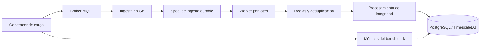

# Pleroma — Benchmark de capacidad

Herramienta de pruebas de carga desarrollada en Go para caracterizar la ingesta MQTT, la persistencia en base de datos, la acumulación de trabajo pendiente y el comportamiento de recuperación de Pleroma.

Este benchmark evalúa cómo se comporta el sistema al aumentar progresivamente las tasas de ingesta de telemetría, distinguiendo los mensajes confirmados por el broker de los registros efectivamente persistidos por el backend.

## Descripción general

Que una publicación MQTT haya sido confirmada no significa necesariamente que el registro de telemetría haya llegado a su destino final en la base de datos.

Pleroma utiliza un spool de ingesta durable para desacoplar la recepción de telemetría del procesamiento y la persistencia posteriores. Cuando la tasa de ingesta supera la capacidad de persistencia observada, el trabajo pendiente puede acumularse en el spool y procesarse posteriormente.

Este benchmark mide ese comportamiento mediante una secuencia de escalones de carga controlados.

Los objetivos principales son:

- Medir el ritmo de persistencia al incrementar la tasa de ingesta.
- Comparar los mensajes confirmados por el broker con los registros persistidos.
- Observar el crecimiento y el drenaje del backlog.
- Identificar la transición entre un funcionamiento cercano al estado estable y la acumulación sostenida de trabajo pendiente.
- Comprobar si los mensajes confirmados terminan representados en la base de datos bajo las condiciones ensayadas.
- Exportar resultados estructurados para su posterior análisis.

## Arquitectura bajo prueba

El benchmark publica telemetría mediante MQTT y observa la persistencia en PostgreSQL/TimescaleDB.

El diagrama representa el flujo lógico evaluado. Los detalles concretos dependen de la versión de Pleroma y de la configuración del entorno bajo prueba.

## ¿Qué mide?

| Métrica | Descripción |
|---|---|
| Tasa de ingesta configurada | Tasa objetivo de publicación, en mensajes por segundo. |
| Mensajes confirmados | Publicaciones para las que el cliente MQTT recibe una confirmación satisfactoria. |
| Publicaciones fallidas | Publicaciones que fallan o agotan el tiempo de espera de confirmación. |
| Registros persistidos | Registros de telemetría coincidentes encontrados en la base al finalizar el escalón. |
| Backlog al cierre | Diferencia entre los mensajes confirmados y los registros persistidos. |
| Pico observado de backlog | Mayor backlog registrado en las muestras periódicas o al finalizar el escalón. |
| Ritmo de persistencia | Estimación de los mensajes persistidos por segundo durante la segunda mitad del escalón. |
| Tiempo de drenaje | Tiempo necesario para persistir los mensajes confirmados que permanecen pendientes al terminar la publicación. |
| Estado de drenaje | Indica si el backlog se vació, quedó estancado o superó el tiempo máximo configurado. |
| Clasificación «al día» | Indica si el escalón cumple los criterios definidos por el benchmark para considerar que sigue el ritmo de ingesta. |

### Confirmación MQTT no es lo mismo que persistencia

El benchmark distingue dos eventos:

1. **Confirmación del broker:** el publicador MQTT recibe una confirmación satisfactoria.
2. **Persistencia en la base de datos:** el registro correspondiente aparece en la tabla consultada.

Ambos eventos no son equivalentes. El benchmark los mide por separado para observar si los mensajes confirmados terminan persistidos.

Una confirmación MQTT, por sí sola, no demuestra la durabilidad de extremo a extremo a través de todos los componentes del sistema.

## Metodología de carga escalonada

La prueba ejecuta una secuencia de tasas de publicación configuradas, ordenadas de menor a mayor.

En cada escalón, el generador:

1. Calcula la cantidad de mensajes a publicar según la tasa objetivo y la duración del escalón.
2. Genera mensajes de telemetría con números de secuencia crecientes.
3. Distribuye el trabajo entre varios clientes MQTT.
4. Programa las publicaciones para aproximarse a la tasa configurada.
5. Muestrea aproximadamente cada segundo la cantidad de mensajes confirmados y registros persistidos.
6. Calcula el backlog al cierre, el pico observado y el ritmo de persistencia.
7. Espera a que los mensajes confirmados pendientes aparezcan en la base de datos, sujeto al tiempo máximo de drenaje.
8. Continúa con el siguiente escalón únicamente si el anterior se drenó satisfactoriamente.

Este procedimiento reduce el riesgo de arrastrar un backlog sin resolver de un escalón al siguiente.

No elimina toda incertidumbre de medición: los picos pueden producirse entre muestras y el ritmo de persistencia es una estimación sobre un intervalo finito.

## Criterios de clasificación

El benchmark utiliza criterios explícitos para clasificar un escalón como `al día`.

Un escalón recibe esa clasificación cuando:

- Los mensajes confirmados se drenaron satisfactoriamente.
- El backlog al cierre es menor o igual al mayor valor entre la tasa configurada y 256 mensajes.
- El ritmo de persistencia estimado durante la segunda mitad del escalón alcanza al menos el 85 % de la tasa configurada.

Esta clasificación es específica del benchmark. En particular, `al día` no implica necesariamente que el backlog haya sido cero durante todo el escalón.

Otros estados posibles:

- `acumula`: el backlog se drenó, pero el escalón no cumplió los criterios para clasificarse como `al día`.
- `ESTANCADO`: el conteo de registros persistidos dejó de avanzar durante más tiempo que el intervalo de estancamiento configurado, mientras quedaban mensajes pendientes.
- `NO DRENÓ`: el backlog restante no se vació dentro del tiempo máximo configurado.

Estos estados describen el comportamiento observado y deben interpretarse junto con las métricas originales.

## Configuración

El benchmark expone los siguientes parámetros de línea de comandos:

| Parámetro | Valor predeterminado | Descripción |
|---|---|---|
| `-db` | URL local de desarrollo de PostgreSQL | Cadena de conexión a la base de datos. |
| `-broker` | `tcp://localhost:1883` | Dirección del broker MQTT. |
| `-rates` | `25,50,75,100,125,150,200,250` | Tasas objetivo separadas por comas, en mensajes por segundo. |
| `-step` | `20s` | Duración de cada escalón. Mínimo: 10 segundos. |
| `-drain-timeout` | `120s` | Tiempo máximo para drenar los mensajes pendientes de un escalón. |
| `-publishers` | `4` | Cantidad de clientes MQTT que publican en paralelo. |
| `-tenant` | `test` | Identificador del tenant en la telemetría generada. |
| `-installation` | `test` | Identificador de instalación. |
| `-gateway` | `test` | Identificador del gateway. |
| `-device` | `capacity-device` | Identificador del dispositivo. |
| `-sensor` | `capacity-sensor` | Identificador del sensor registrado que utiliza la prueba. |
| `-csv` | Vacío | Ruta opcional para exportar los resultados a CSV. |

El broker, la base de datos y los identificadores deben coincidir con el entorno bajo prueba.

## Requisitos previos

- Go instalado y configurado.
- Acceso a un broker MQTT.
- Acceso a la instancia de PostgreSQL/TimescaleDB utilizada por Pleroma.
- Pipeline de ingesta y persistencia de Pleroma en funcionamiento.
- Un sensor registrado que coincida con el identificador configurado.
- Permisos para consultar la tabla de telemetría utilizada por el benchmark.

La implementación actual espera una tabla `telemetry` con las columnas `sensor_id` y `sequence`. Si el esquema cambia, será necesario adaptar la consulta.

## Ejecución

El código del benchmark se publica como documentación técnica de la metodología de pruebas de carga utilizada durante el desarrollo de Pleroma.

La ejecución completa requiere una instancia funcional de Pleroma, con acceso al broker MQTT y a la base de datos que utiliza su pipeline de ingesta y persistencia. El código fuente de Pleroma y sus componentes internos no forman parte de este repositorio público.

Por lo tanto, el generador no constituye por sí solo un entorno de pruebas autónomo. Los parámetros, las consultas y los ejemplos de ejecución documentan cómo se realizó el experimento y permiten adaptar la metodología a un entorno compatible.

Los resultados publicados corresponden a la configuración y las condiciones específicas indicadas en cada experimento.

### Precauciones operativas

- Ejecutar las pruebas en un entorno de desarrollo o staging dedicado.
- Asegurarse de que las consultas puedan distinguir los registros de prueba de otras mediciones.
- Evitar pruebas concurrentes que publiquen en el mismo sensor y rango de secuencias.
- Utilizar rangos de secuencia únicos en cada ejecución para evitar colisiones con registros existentes.
- Comenzar con tasas bajas y duraciones cortas antes de aumentar la carga.
- No ejecutar pruebas de estrés contra equipos industriales en producción sin autorización y un plan de pruebas adecuado.

## Exportación a CSV

Cuando se especifica `-csv`, el benchmark exporta los siguientes campos:

- `rate_msg_s`
- `confirmed`
- `failed_publish`
- `persisted_at_end`
- `lag_end`
- `lag_peak`
- `persist_rate_2nd_half`
- `drain_s`
- `drained`
- `stalled`
- `keeps_up`

El CSV permite analizar resultados, comparar ejecuciones y representar la relación entre tasa de ingesta, persistencia y backlog.

## Resultados de ejemplo

En un experimento local de carga escalonada, la tasa configurada aumentó de 25 a 225 mensajes por segundo, con una duración de 20 segundos por escalón.

El comportamiento observado mostró una transición desde un funcionamiento cercano al estado estable hacia la acumulación sostenida de backlog en las tasas más altas. En el mismo experimento, el backlog restante se drenó después de la fase de publicación en todos los escalones evaluados.

Estos resultados corresponden exclusivamente a esa ejecución y configuración. No deben interpretarse como garantías universales de rendimiento ni como evidencia de que el sistema se comportará de la misma manera con otro hardware, condiciones de red, cantidad de sensores o carga de persistencia.

## Limitaciones

La prueba actual tiene varias limitaciones importantes:

- El broker, el backend, la base de datos y el generador de carga se ejecutan en la misma máquina local.
- Las publicaciones se concentran en un dispositivo, un sensor registrado y una única cadena de hash.
- Cada escalón se mide en una sola corrida, sin repeticiones independientes.
- El backlog se muestrea periódicamente, por lo que pueden pasar inadvertidos picos breves.
- El ritmo de persistencia se estima durante la segunda mitad de cada escalón.
- Los resultados dependen del esquema de la base de datos, la configuración del broker, el tamaño de lote del worker y la implementación evaluada.
- Un conteo satisfactorio de registros en la base no demuestra por sí solo la integridad criptográfica, la corrección semántica ni la ausencia de todos los escenarios posibles de pérdida de datos.

Para obtener estimaciones de capacidad más robustas, se recomienda repetir cada nivel relevante, aumentar la duración de las pruebas, informar la variabilidad y evaluar por separado interrupciones de la base de datos, saturación del broker, reinicios de procesos y recuperación.

## Objetivo de ingeniería

El propósito de este benchmark no es simplemente producir una cifra máxima de mensajes por segundo.

Busca comprender cómo se comporta Pleroma bajo carga, identificar cuándo la persistencia queda por detrás de la ingesta, medir la acumulación de trabajo pendiente y observar si el sistema se recupera cuando disminuye la carga.

Estas mediciones permiten orientar el dimensionamiento de capacidad e identificar los siguientes cuellos de botella que deben investigarse.

---

Parte de la documentación pública de ingeniería de **Pleroma**, desarrollado por **Treetech**, en Bahía Blanca, Argentina.

Sitio web: https://treetech.ar
